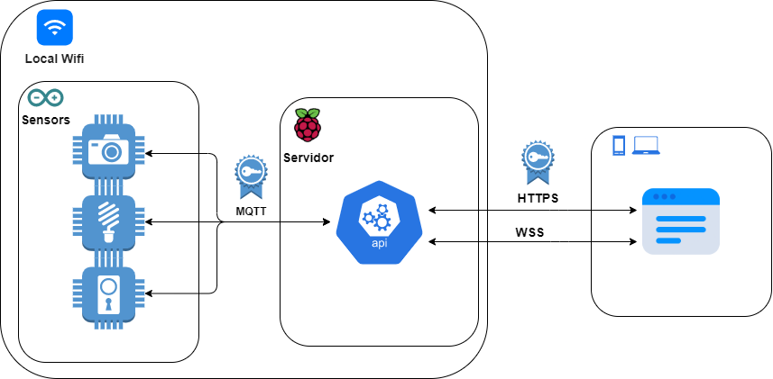
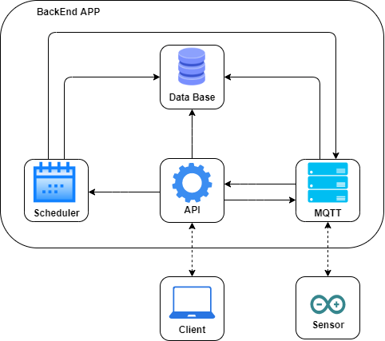

# DomoHouse

In recent years, the inclusion of technologies in society has been
standardised, normalising home automation systems. The development of
these systems by large private corporations results in exposing and leaving
vulnerable the user privacy. Therefore, this project describes the creation
and implementation of a completely open-source and secure home
automation system. Home automation systems consist of three elements:
Internet of Things (IoT) devices, the control platform and the user interface.
The communication system has been implemented to unify the three
elements to maintain, analyse, and retransmit the data. Data privacy and
security ensure that communications are not visible to an individual outside
the system. Security in communications has been carried out using the
latest encryption protocols supported by a system of certificates and
authentications. The control of the data generated within the system has
been stored only on the server, restricting access to prevent unauthorised
data extraction. As a result of creating the three sections of the home
automation system and the implementation of communication between
them, excellent fluidity has been obtained in all communications.
Additionally, the resulting system supports more components than the
required to implement a smart home. Finally, an optimal home automation
system has been achieved, which maintains control of IoT devices
autonomously

----------------

### [FrontEnd Example](https://home.tonicifre.com/)

## Devices IoT:

All IoT device firmwares are open source and customizable.

#### IoT sensor:
 - Switches (Rele)
 - Sensors I/O (Pir, magnetic dor sensor...)
 - Activate sensors (DHT-11, FC-28, MQ-135...)
 - Cameras (ESP-32 Cam)
 - Energy monitors (PZEM 004t)

#### single-board computer used:
 - Server on raspberry pi 4
 - IoT sensors controlled with: ESP-01, ESP-12F and ESP-32

## System Architecture
#### system communication architecture:

## BackEnd:

#### Python libraries highlights:
 - PyJWT
 - Flask
 - Gevent
 - OpenCV2
 - Schedule
 - Waitress
 - Werkzeug
 - Paho.mqtt
 - Flask-SocketIO
 - Flask-httpauth

#### class visibility architecture:
 

## FrontEnd:

#### Used technology:
 - React
 - Redux
 - Axios
 - Base-64 (for encode/decode camera images)
 - Socket.io
 - Notistack
 - Material ui
 - DX React chart

